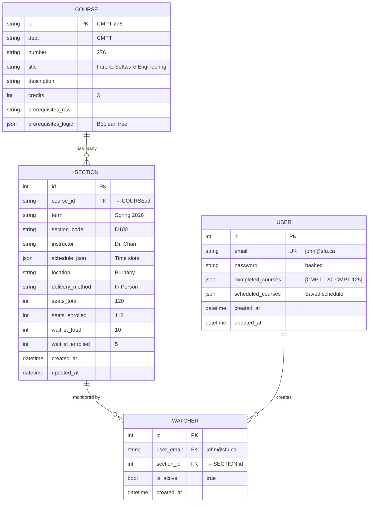
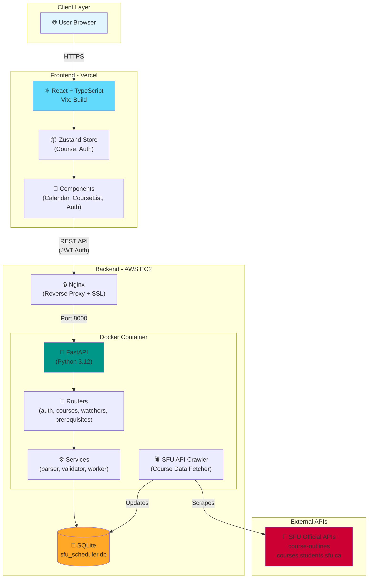
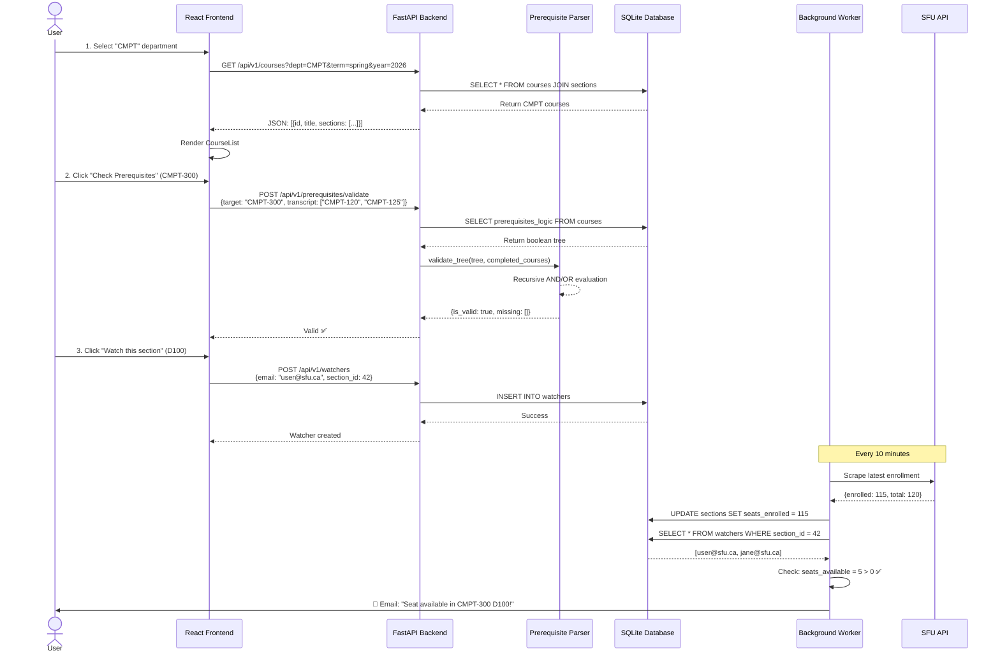
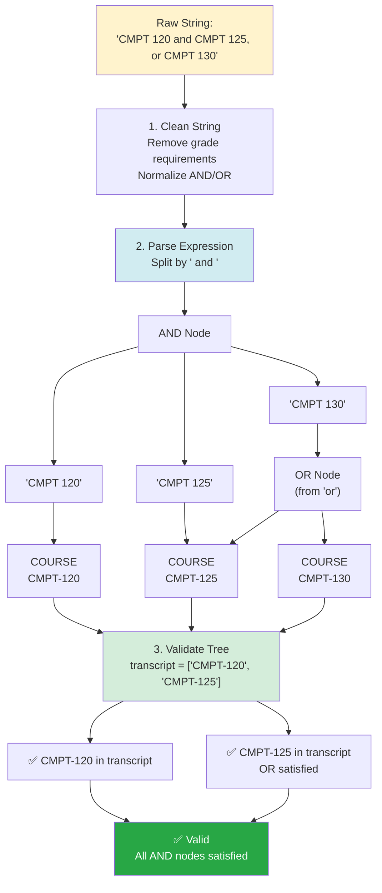

# 📊 SFU Course Tracker - System Diagrams

This document contains UML and architectural diagrams for the SFU Course Tracker project.

---

## 🗄️ Database Schema (ERD) - 3NF Design

Shows the normalized database structure with relationships between entities.

**Key Design Decisions:**
- **3NF Normalization**: Course metadata separated from Section instances
- **Foreign Keys**: `section_id` and `course_id` indexed for fast joins
- **JSON Columns**: `prerequisites_logic` stores recursive boolean trees, `completed_courses` stores user transcripts
- **Calculated Property**: `seats_available` computed as `seats_total - seats_enrolled`

---

## 🏗️ System Architecture - Docker Compose Stack

Shows the full-stack deployment architecture across Vercel (frontend) and AWS EC2 (backend).

**Technology Stack:**
- **Frontend**: React 18 + TypeScript + Vite (deployed on Vercel)
- **Backend**: FastAPI + Python 3.12 (deployed on AWS EC2)
- **Proxy**: Nginx with Let's Encrypt SSL certificates
- **Database**: SQLite with WAL mode for concurrent reads
- **Containerization**: Docker Compose orchestration

---

## 🔄 User Flow - Course Search & Watch

Sequence diagram showing a typical user interaction from search to seat notification.

**Key Interactions:**
1. **Course Search**: Frontend filters by department, backend joins `courses` and `sections` tables
2. **Prerequisite Check**: Recursive parser evaluates boolean tree against user's transcript
3. **Watcher Creation**: Creates junction record between user and section
4. **Background Worker**: Scheduled task checks SFU API every 10 minutes, notifies watchers when seats open

---

## 🧠 Prerequisite Parser - Recursive Logic Tree

Illustrates how complex prerequisite strings are parsed into evaluable boolean trees.

**Parser Logic:**
- **Operator Precedence**: `and` > `,` (comma) > `or` > parentheses
- **Recursive Descent**: Handles nested expressions like `(A OR B) AND (C OR (D AND E))`
- **Validation**: DFS traversal of tree, propagates boolean results up from leaf COURSE nodes

---

## 🚀 CI/CD Pipeline - GitHub Actions Deployment

Automated deployment workflow from code push to production.

```mermaid
graph LR
    subgraph "Developer"
        Dev["👨‍💻 Developer<br/>git push"]
    end
    
    subgraph "GitHub"
        GH["🐙 GitHub Repo<br/>main branch"]
        Actions["⚙️ GitHub Actions<br/>.github/workflows/deploy.yml"]
    end
    
    subgraph "Build Process"
        Checkout["📥 Checkout code"]
        Build["🔨 Build Images<br/>docker compose build"]
        Test["🧪 Run tests<br/>(if configured)"]
    end
    
    subgraph "Deployment - AWS EC2"
        SSH["🔐 SSH Connection<br/>(30min timeout)"]
        Pull["📦 git pull"]
        Deploy["🚀 docker compose up -d<br/>--build (with cache)"]
        Health["✅ Health Check"]
    end
    
    subgraph "Production"
        Live["🌐 api.sfucourseplanner.me<br/>Nginx + FastAPI + SQLite"]
    end
    
    Dev -->|push| GH
    GH -->|trigger| Actions
    Actions --> Checkout
    Checkout --> Build
    Build --> Test
    Test --> SSH
    SSH --> Pull
    Pull --> Deploy
    Deploy --> Health
    Health -->|success| Live
    
    style Dev fill:#e1f5ff
    style Actions fill:#2088ff
    style Deploy fill:#28a745
    style Live fill:#ffa726
```

**Pipeline Stages:**
1. **Trigger**: Any push to `main` branch starts the workflow
2. **Build**: GitHub Actions runner builds Docker images with layer caching
3. **Deploy**: SSH into EC2 (with 30min timeout to handle slow builds)
4. **Production**: `docker compose up -d --build` restarts containers with zero downtime

**Key Features:**
- **Docker Layer Caching**: Speeds up builds from 15min → 5min
- **SSH Timeout**: Extended to 30 minutes to handle cold EC2 starts
- **Zero Downtime**: SQLite database persisted via volume mount

---

## 📚 Interview Talking Points

### "Walk me through your architecture"

> "I built a full-stack course tracker with **separation of concerns**:
> 
> **Frontend (Vercel)**: React SPA with TypeScript for type safety. Zustand manages client state, and components are organized by feature (Layout, Calendar, Auth).
> 
> **Backend (AWS EC2)**: FastAPI serves REST endpoints, containerized with Docker. SQLModel handles ORM with SQLAlchemy under the hood. Nginx reverse proxies with Let's Encrypt SSL.
> 
> **Database**: SQLite with a normalized 3NF schema. The key design is separating static course metadata from dynamic section instances, preventing data duplication when courses update.
> 
> **Background Worker**: A scheduler scrapes SFU APIs every 10 minutes, updates seat counts, and queries the `watchers` junction table to send notifications."

### "Explain your prerequisite parser"

> "SFU's prerequisite strings are complex nested boolean logic like `(A OR B) AND (C OR D)`.
> 
> I built a **recursive descent parser** that:
> 1. **Cleans** the raw string (removes grade requirements, normalizes operators)
> 2. **Parses** with operator precedence: `AND` → `,` → `OR` → `()`
> 3. **Builds** a JSON tree structure: `{type: 'AND', children: [{type: 'COURSE', course: 'CMPT-120'}, ...]}`
> 4. **Validates** by recursively checking if user's transcript satisfies the tree
> 
> This is stored in the database as a JSON column (`prerequisites_logic`), so validation is O(n) tree traversal instead of re-parsing on every request."

### "How does your deployment work?"

> "I use **GitHub Actions** for CI/CD. On every push to `main`:
> 
> 1. Actions runner SSHs into EC2 (30min timeout for reliability)
> 2. Pulls latest code and runs `docker compose up -d --build`
> 3. Docker layer caching speeds up builds (5min vs 15min cold)
> 4. SQLite database persists via volume mount, so no data loss on redeploy
> 
> Frontend deploys separately to Vercel with automatic SSL and CDN. The two communicate via CORS-enabled REST API."

---

## 🔗 Resources

- **Live Demo**: [sfucourseplanner.me](https://www.sfucourseplanner.me)
- **API Docs**: [api.sfucourseplanner.me/docs](https://api.sfucourseplanner.me/docs)
- **GitHub Repo**: [SFU-Course-Tracker](https://github.com/ttn54/SFU-Course-Tracker)
- **Mermaid Docs**: [mermaid.js.org](https://mermaid.js.org)

---

**Built with ❤️ for SFU students by students**
